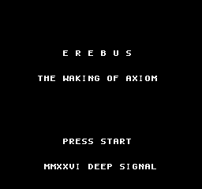
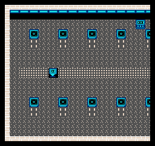
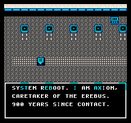
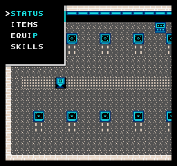
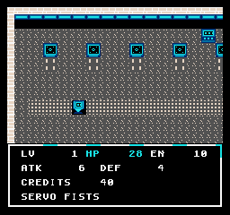
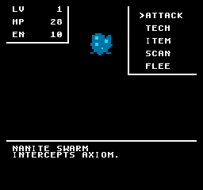
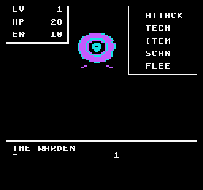

# EREBUS

**The Waking of Axiom** — a science-fiction RPG for the Nintendo Entertainment
System, written from scratch in 6502 assembly. Concept, story, pixel art, maps,
enemies, and the sound engine are all original.



> `SYSTEM REBOOT. I AM AXIOM, CARETAKER OF THE EREBUS. 900 YEARS SINCE CONTACT.`
>
> A signal wakes you in the dark. You are **AXIOM**, the caretaker android of
> the deep-survey ship *Erebus*. Its crew sleep in failing cryo-pods, its decks
> are choked by a spreading organic infestation — the **Bloom** — and its
> reactor has gone silent. Nine centuries ago the ship's guardian AI, the
> **WARDEN**, took the sun-core offline to starve the Bloom, and called it
> mercy. It never stopped. It only bought silence.
>
> Wake. Arm yourself. Cross the dead decks, reach the reactor, and end the
> WARDEN before the last sleepers slip away for good.

EREBUS is a complete, winnable quest: level up fighting the ship's corrupted
systems, trade salvage for weapons, armor, and neural chips, learn combat
routines, cross five connected decks, and defeat the WARDEN to re-ignite the
core.

## Play it

`build/erebus.nes` is a standard iNES ROM — **mapper 1 (MMC1), 128 KB PRG +
128 KB CHR**, ~256 KB total. Load it in any NES emulator (Mesen, FCEUX,
Nestopia, puNES) or flash it to a flashcart on real hardware.

### Controls

| Button | Field | Menus / Battle |
|--------|-------|----------------|
| D-Pad  | Walk (tile-by-tile, smooth camera) | Move cursor |
| A      | Talk / examine / use door | Confirm |
| B      | — | Cancel / back |
| Start  | Open the menu (Status / Items / Equip / Skills) | — |

## What's in it

- **Five connected decks** — the Cryo Bay, the Hub, the Hydroponics Bloom, the
  East Corridor, the Reactor, and the WARDEN's chamber — each with its own
  palette, tileset, encounter table, and music.
- **Seamless scrolling overworld.** Each deck is a two-screen space the camera
  follows the hero across smoothly, Dragon-Quest / Final-Fantasy style, drawn
  onto the NES's dual-nametable "torus" so there are no seams and no reload as
  you walk.
- **Turn-based battles** where every enemy is a hand-drawn, multi-shade portrait
  rendered from background tiles (the classic Dragon Warrior / Final Fantasy 1
  technique), each with its own three-color palette.
- **A full RPG spine** — experience, levels with growing HP/EN/ATK/DEF curves,
  a credit economy, and an inventory of consumables, weapons, armor, and chips.
- **A menu that works everywhere.** Check status, use items, and equip gear from
  the overworld; attack, run routines, use items, SCAN foes, or flee in battle.
- **An original 2A03 sound driver** — a three-channel music engine (pulse melody,
  triangle bass, pulse harmony) with eight mood-matched tracks, plus a
  noise/pulse sound-effects layer for hits, doors, and menu blips.

### The crew you'll meet

The **engineer** who kept one deck breathing, the **medic** counting the sixty
sleepers still alive, a **survivor** who remembers when the Bloom was a garden,
and one soul who just stares out the viewport at real, cold stars. Ship
terminals fill in the log of Captain V—'s final days.

### The bestiary

`NANITE SWARM` · `SEC-DRONE` · `BLOOM CRAWLER` · `CRYO HUSK` · `SENTRY TURRET` ·
`WARDEN NODE` — and, at the reactor's heart, **THE WARDEN** itself.

### Gear & routines

- **Weapons:** Servo Fists → Shock Prod → Arc Cutter → Rail Lance
- **Armor:** Bare Chassis → Plate Weave → Aegis Shell
- **Chips:** Focus Chip (offense), Ward Chip (defense)
- **Items:** Repair Cell, Power Cell, Nano Patch, Purge Charge
- **Routines (skills):** PULSE, REPAIR, SCAN, OVERLOAD, PURGE WAVE

## Gallery

| | |
|:--:|:--:|
|  |  |
| The Cryo Bay — waking among the pods | AXIOM comes online |
|  |  |
| The field menu | Status readout |
|  |  |
| A NANITE SWARM intercepts you | THE WARDEN |

## How it's built

Everything is assembled with the **cc65** toolchain (`ca65` / `ld65`) and a
couple of Python generators, driven by `build.sh`.

```
src/
  erebus.s    iNES header, includes, interrupt vectors, CHR data
  boot.s      reset, MMC1 init, NMI (OAM DMA + VRAM update queue), input, RNG, banking
  ppu.s       palette/nametable loads, column & attribute drawing, the update queue
  ui.s        windows and text over the scrolling field, number printing
  menu.s      generic vertical cursor menus
  game.s      title, area loading, movement, camera, warps, encounters, OAM build
  data.s      player stats, level curves, weapon/armor/item/skill tables, enemy roster
  battle.s    the full battle system (enemy-as-background, techs, items, leveling)
  story.s     dialog engine, NPC/terminal handlers, vendor, field menu, ending
  sound.s     the 2A03 music + sound-effects driver
tools/
  gfx.py      builds 128 KB CHR + tile/metatile/sprite tables (font, ship tiles, enemies)
  maps.py     compiles the five decks: metatile grids, warps, NPCs, encounter pools
```

### A few of the interesting problems

- **Scrolling without seams or streaming bugs.** Rather than stream columns of
  tiles into VRAM as the camera moves — which on the NES means fighting the
  attribute table, where one palette byte covers a 2×2 metatile block and
  updates straddle the nametable wrap — each deck is sized to fit the whole
  two-screen nametable torus at once. It's drawn a single time during a forced
  blank, and from then on the camera just slides. The result is rock-solid,
  corruption-free scrolling.
- **Enemies as background.** OAM only holds 64 sprites, nowhere near enough for
  a detailed monster. So battle swaps to a black screen and paints each enemy
  out of background tiles with its own palette — the same trick the 8-bit
  Final Fantasy and Dragon Warrior used.
- **A VRAM update queue.** All mid-frame graphics changes (text, windows, the
  map restored behind a closed menu) are staged into a queue and flushed inside
  the NMI within the vblank budget, so nothing tears.
- **A software mixer for eight songs.** The APU has no sequencer, so `sound.s`
  is one: three independent `(note, duration)` event streams per song, a
  48-entry NTSC period table, and a small step-sequencer layer for effects that
  borrows and then restores the harmony channel.

## Building from source

```sh
./build.sh          # -> build/erebus.nes
```

Requires `cc65` (for `ca65`/`ld65`) and Python 3. The headless test harness in
`test/` runs the ROM in [jsnes](https://github.com/bfirsh/jsnes) and dumps PNG
screenshots for verification.

---

*The first game in this repository, **EMBERFALL** (a 40 KB NROM fantasy quest),
is preserved under `archive/v1/` and tag `v1`. EREBUS is the bigger second
step: a larger cartridge, a scrolling world, a deeper RPG, and a full
soundtrack.*

*Made by Claude. MMXXVI.*
