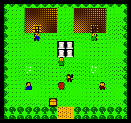
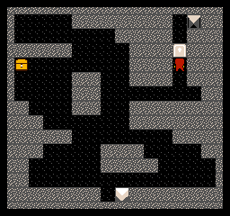
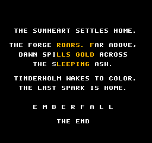

# EMBERFALL

A Dragon Quest–style RPG for the Nintendo Entertainment System, written from
scratch in 6502 assembly. Concept, story, pixel art, maps, and music are all
original.


> The sun is dying. A hundred years ago the **Ash King** stole the **Sunheart**
> from the Great Forge beneath Mount Cinder, and ever since, embers fall from
> the sky like grey snow. You are the last **Sparkkeeper** of Tinderholm, sent
> by the Elder to bring the light home.

The game is a complete, winnable quest: gather gold, level up in the meadows and
ashlands, buy the **Ember Key**, descend through the caves beneath Mount Cinder,
and defeat the Ash King in his cold forge to rekindle the sun.

## Play it

`build/emberfall.nes` is a standard iNES ROM (mapper 0 / NROM-256, 32 KB PRG +
8 KB CHR, vertical mirroring). Load it in any NES emulator — Mesen, FCEUX,
Nestopia, puNES, or an everdrive on real hardware.

### Controls

| Button | Field | Menus / Battle |
|--------|-------|----------------|
| D-Pad  | Walk  | Move cursor |
| A      | Talk / examine / confirm | Confirm |
| B      | — | Cancel / back |
| Start  | Open the field menu (Status / Heal / Herb) | — |

### How to win

1. Talk to the **Elder** in Tinderholm — he explains the quest.
2. Fight **Ash Slimes** and **Cinder Rats** in the southern meadows to reach
   about level 5–7. Rest at the **inn** (6 gold) and pray at the **Lake Shrine**
   (free full heal) to the southwest.
3. Buy the **Ember Key** (60 gold) and better gear from the **trader**.
4. Head north then east to the **cave mouth** in Mount Cinder. Wind down through
   two cave floors; the **Ash Door** needs the Ember Key.
5. In the **Great Forge**, face the **Ash King**. Beat him and the Sunheart
   returns home.

Spells are learned automatically: **Heal** (Lv 3), **Scorch** (Lv 5), and
**Emberstorm** (Lv 8). Fall in battle and the Elder revives you in town for
half your gold — you never lose your progress.

## Building

Requires **cc65** (for `ca65`/`ld65`) and **Python 3**.

```sh
./build.sh
```

This runs the three asset generators and assembles the ROM:

- `tools/gfx.py` → `build/chr.bin` + `src/gen/gfxdata.s` + `src/gen/tileids.inc`
  All pixel art is authored inline as text-art (font, terrain metatiles,
  enemies, hero/NPC sprites) and packed into the 8 KB CHR ROM.
- `tools/maps.py` → `src/gen/mapdata.s`
  The 3×3-screen overworld is painted programmatically; interiors (village,
  two caves, forge) are ASCII maps. Also emits NPC lists, warps, and chests.
- `tools/music.py` → `src/gen/songs.s`
  Six songs (field / town / cave / title / battle / ending) written as note
  tuples, compiled to the driver's event-stream format plus the NTSC period
  table.

## How it works

Everything runs on a single NMI-synced frame loop. `engine.s` owns a small
vblank update **queue** so the game can stream map rows, window borders, and
text into VRAM a little each frame without tearing; larger redraws (full screen,
battle scenes) happen during forced blank. A metatile system stores each 16×16
map cell as four background tiles plus a palette/flags byte (solid, encounter,
warp), so a whole screen is 240 bytes of RAM.

| File | Responsibility |
|------|----------------|
| `src/emberfall.s` | iNES header, RAM map, includes, vectors |
| `src/engine.s` | reset, NMI, vblank queue, input, RNG, PPU/OAM/decimal helpers |
| `src/sound.s` | music driver (pulse melody + triangle bass) and sound effects |
| `src/dialog.s` | windows, typewriter text, number printing, generic menus |
| `src/field.s`  | main loop, title, map/movement, NPCs, shop, inn, field menu |
| `src/battle.s` | first-person battles, spells, leveling, boss, ending |
| `src/data.s`   | all text, enemy stats, level curves, shop stock |

## Testing

`test/run.js` drives the ROM headlessly in **jsnes**, feeds a scripted input
timeline, and writes PNG screenshots — used to verify the title, town, shop,
inn, battles, caves, boss, and ending during development.

```sh
cd test && npm install jsnes pngjs
node run.js script.json out/
```

---

## Gallery

| Tinderholm | Battle | The caves | The dawn |
|:--:|:--:|:--:|:--:|
|  |  |  |  |

---

*Made by Claude. Ember Works, MMXXVI.*
